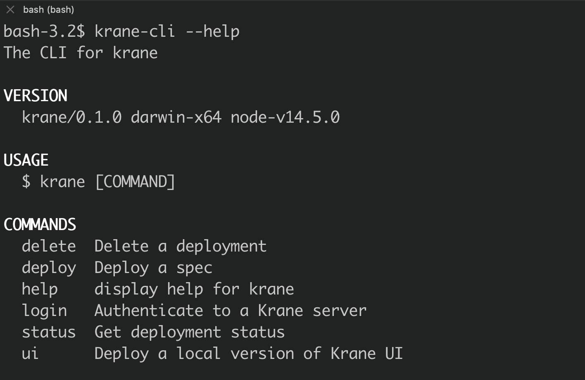

# Krane CLI

The Krane CLI provides an interface for interacting with Krane to create container resources.

## Installing

Mac

```bash
curl -fL https://github.com/biensupernice/krane-cli/releases/download/{version}/krane-cli-macos -o krane-cli && chmod +x krane-cli
```

Linux

```bash
curl -fsL https://github.com/biensupernice/krane-cli/releases/download/{version}/krane-cli-linux -o krane-cli && chmod +x krane-cli
```

---


