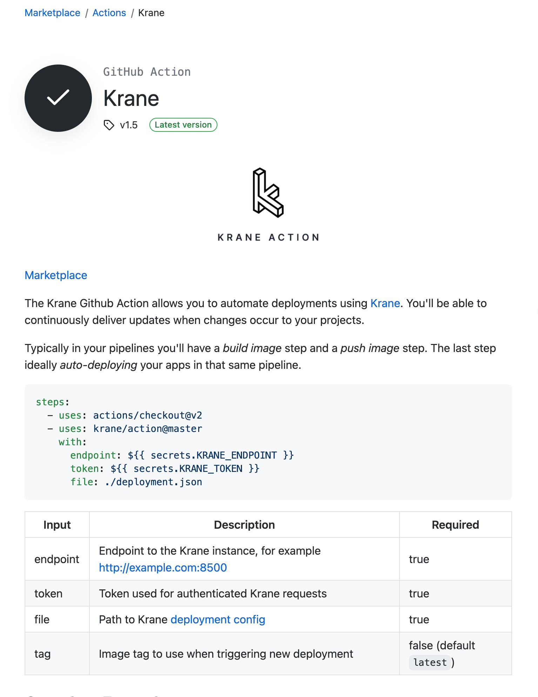

# GitHub Action

The Krane [Github Action](https://github.com/krane/action) allows you to automate deployments using Krane. You'll be able to continuously deliver updates when changes occur to your projects.

For complete documentation, checkout the [action](https://github.com/marketplace/actions/krane) on the GitHub Marketplace.

