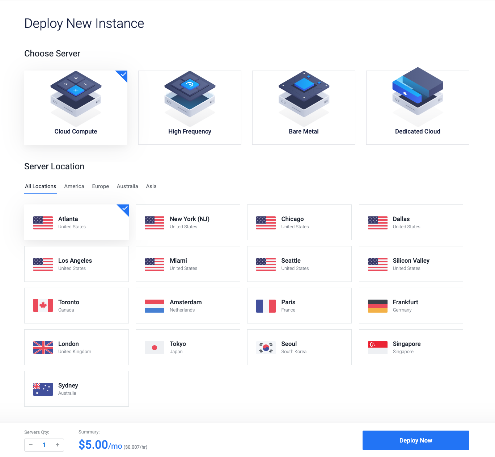
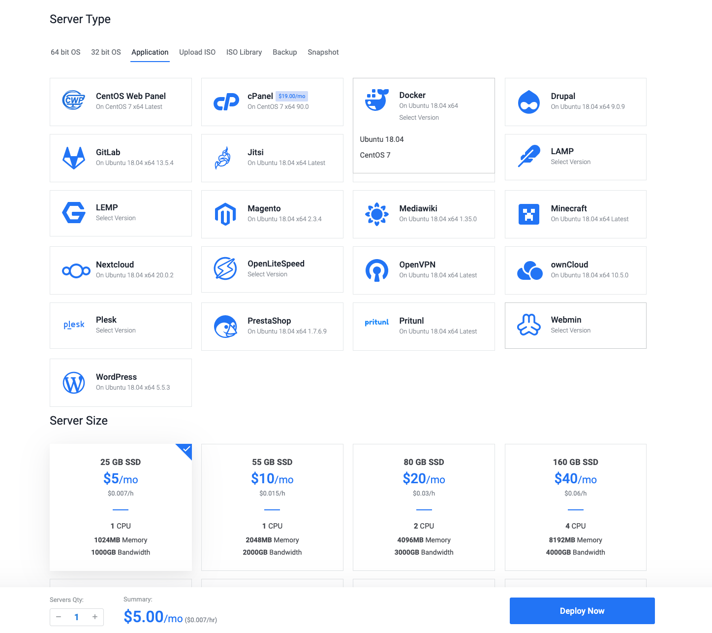
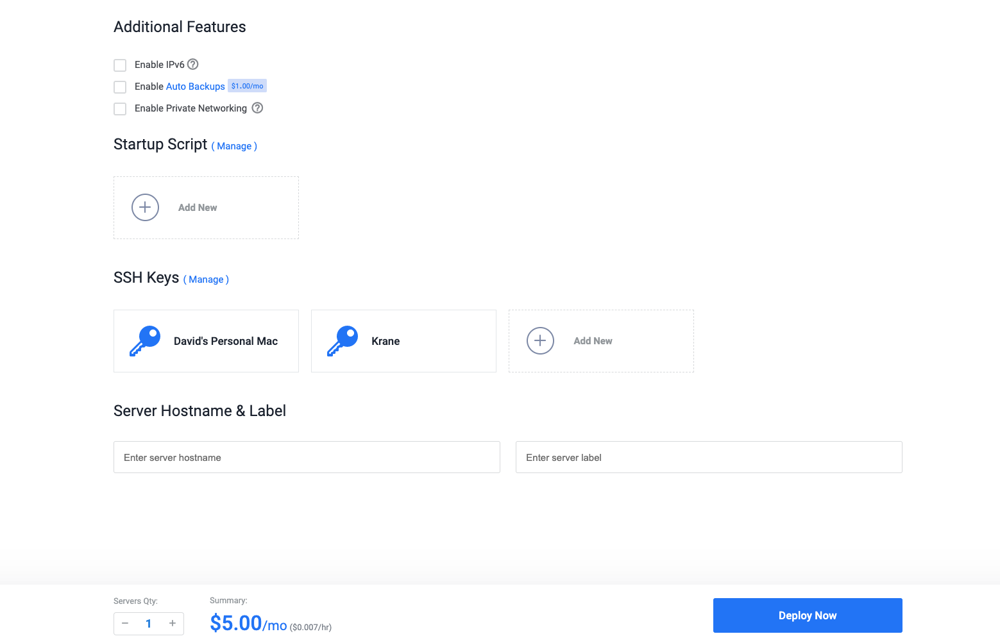
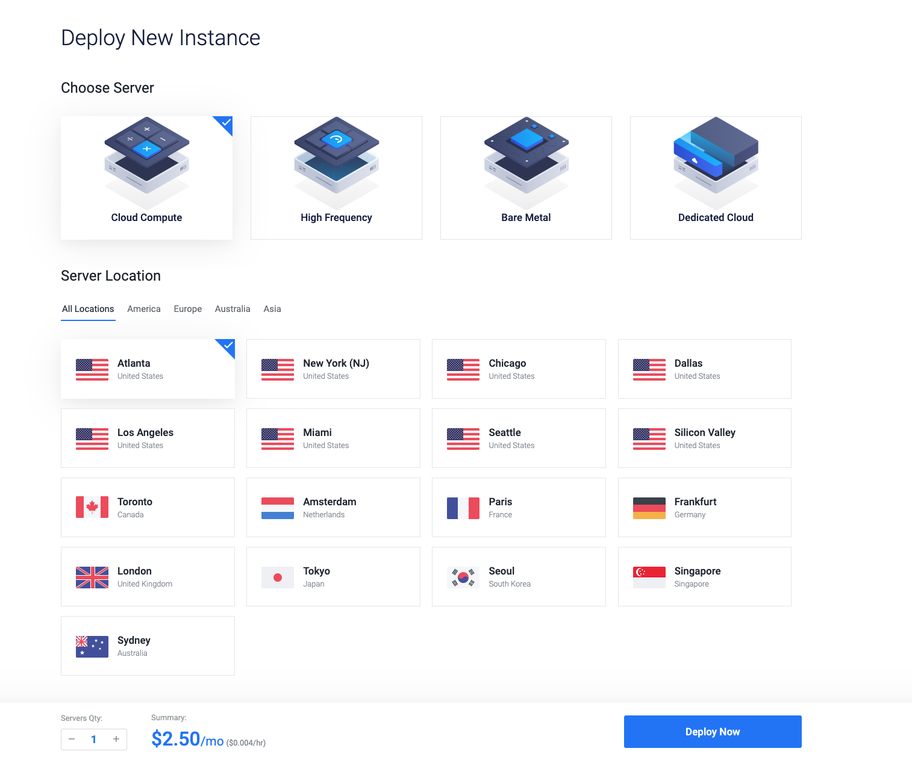
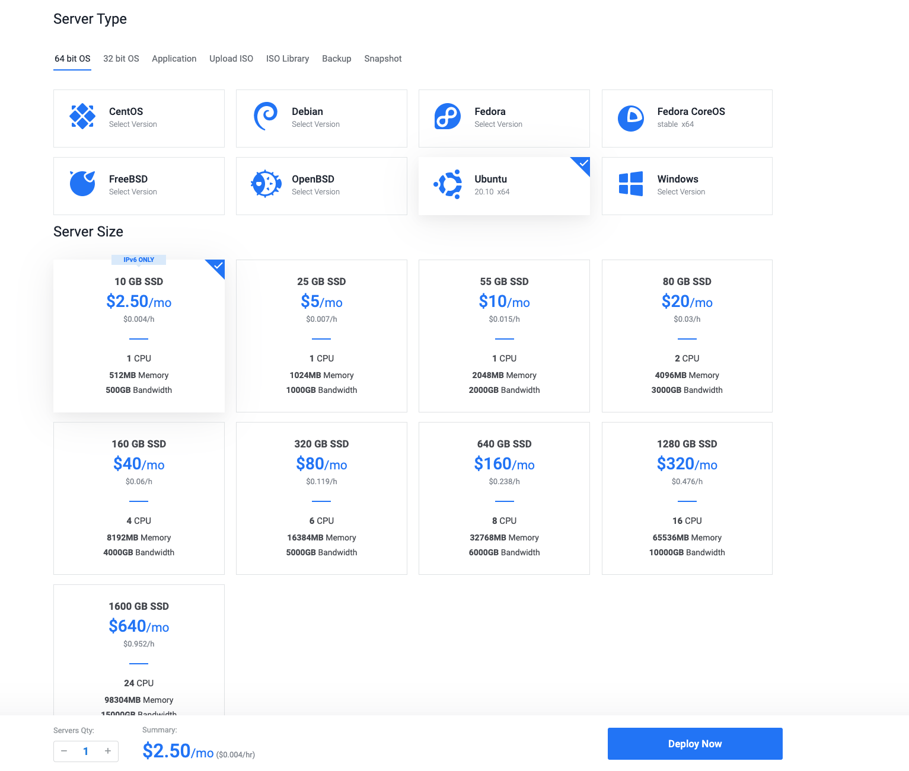
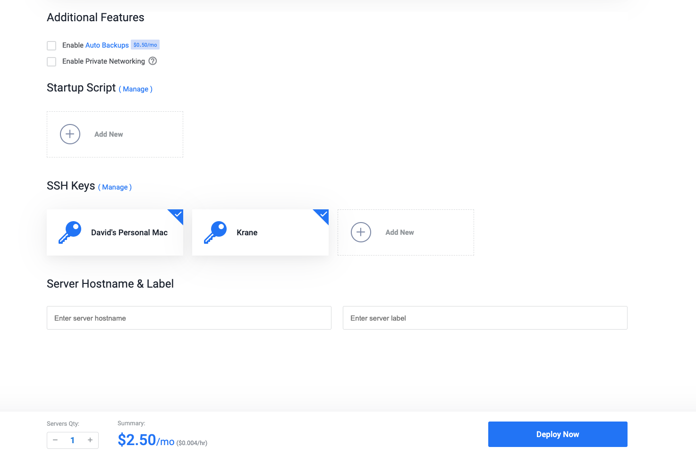
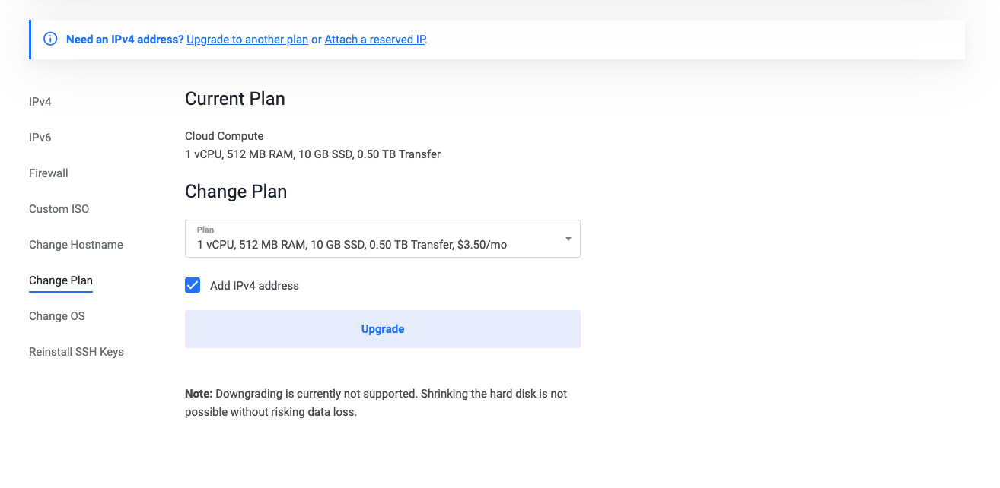
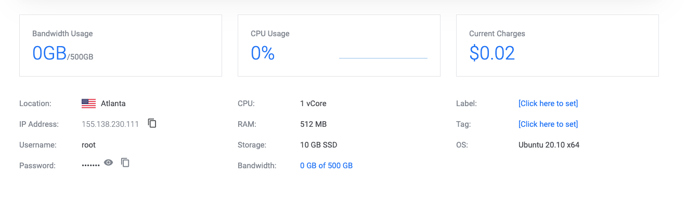

# Vultr

[Vultr](https://www.vultr.com/) is an infrastructure provider with low-cost offerings on cloud servers.

> The following guides assumes you have a [Vultr](https://my.vultr.com/) account and can access the dashboard

### $5 / month

> Note: Vultr's $5.00 offering supports ipv4

Under **Products** click the **+** sign or find _Deploy New Server_

Select **Cloud Compute** and the location closest to you.

<span class="img-wrapper"></span>

For the server type, under the **Application** tab select **Docker (Ubuntu 18.04)**

<span class="img-wrapper"></span>

Under **SSH Keys** add your public key.

This is usually under `~/.ssh/id_rsa`. **David's Personal Mac** being my `id_rsa`.

You can ignore the key labeled **Krane**.

<span class="img-wrapper"></span>

Click **Deploy Now** to create the server.

...

Once the server has been created, you'll want configure the [Vultr dns](https://www.vultr.com/docs/introduction-to-vultr-dns) with your domain provider. This will setup the domain you'll be using to point to your new server.

> tldr; DNS → (+) Add Domain → `Domain` example.com and `Default IP Address` server ip

Once you're able to `ssh` into your new server, follow the [getting started](docs/getting-started) to install Krane.

---

### $3.50 / month

> Note: We start out by creating a $2.50 server and upgrading to $3.50 to enable ipv4

This guide is a bit more involved than the [$5](docs/guides/vultr?id=_5-month) guide. It will require us to install Docker manually.

Under **Products** click the **+** sign or find _Deploy New Server_

Select **Cloud Compute** and the location closest to you.

<span class="img-wrapper"></span>

For the server type, under the **64 bit OS** tab select Ubuntu **(Ubuntu 20.10 x64)**

<span class="img-wrapper"></span>

Under SSH Keys add your public key.

This is usually under `~/.ssh/id_rsa`. **David's Personal Mac** being my `id_rsa`.

You can ignore the key labeled Krane.

<span class="img-wrapper"></span>

Click **Deploy Now** to create the server.

...

Next we'll have to upgrade our **$2.50 plan** to a **$3.50** plan to enable ipv4.

From the **Change Hostname** dropdown select the $3.50 plan.

<span class="img-wrapper"></span>

Once the server has been created and configured with ipv4, you'll want to optionally configure the [Vultr dns](https://www.vultr.com/docs/introduction-to-vultr-dns) with your domain provider. This will setup the domain you'll be using to point to your new server.

> tldr; DNS → (+) Add Domain → `Domain` example.com and `Default IP Address` server ip

You can find the `ip`, default `username` and `password` under the server information page.

<span class="img-wrapper"></span>

Try to `ssh` into your new server

```
ssh root@<server-ip>
```

Once you're inside the server, we'll have to install Docker

`1/3` Add the Docker GPG key to ensure official downloads

```
curl -fsSL https://download.docker.com/linux/ubuntu/gpg | sudo apt-key add -
```

`2/3` Add Docker to apt repository to manage distributions

```
sudo add-apt-repository "deb [arch=amd64] https://download.docker.com/linux/ubuntu $(lsb_release -cs) stable"
```

`3/3` Install Docker

```
sudo apt-get install -y docker-ce
```

And your done!

Try printing the Docker version to verify installation

```
docker -v
```

Now that you have your server setup with Docker, follow the [getting started](docs/getting-started) to install Krane
