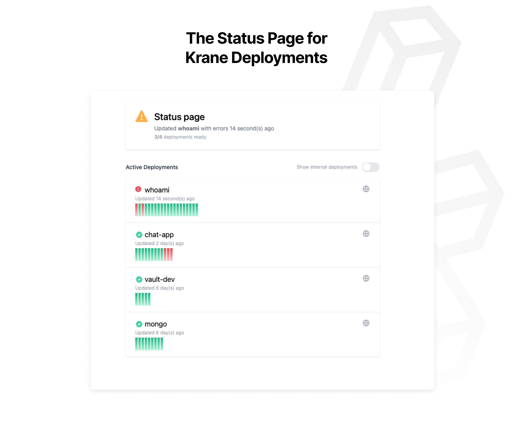

# Status Page

The [Krane UI](https://github.com/krane/ui) is an observability dashboard exposing the status of Krane deployments.

<span class="img-wrapper"></span>

## Deploying

The Krane UI is packaged up into a [Docker image](https://hub.docker.com/repository/docker/biensupernice/krane-ui), so you can deploy directly using Krane.

`deployment.json` 
 ```json
 {
   "name": "krane-ui",
   "image": "biensupernice/krane-ui",
   "secure": true,
   "alias": ["status.example.com"],
   "secrets": {
     "KRANE_ENDPOINT": "https://krane.example.com",
     "KRANE_TOKEN": "@KRANE_TOKEN"
   }
 }
```

```
krane deploy -f /path/to/deployment.json
```

> It's recommended to use [secrets](http://docs.krane.sh/#/docs/deployment?id=secrets) to protect against plain-text access tokens
    
## FAQ

For most use cases set it to `http://krane:8500`... this reference the Krane instance running on the same [Docker stack](https://docs.docker.com/engine/reference/commandline/stack/) and enables container-to-container communication.

You can also deploy a Status Page pointing to any Krane instance... if that Krane instance is in a separate Docker stack, just reference it by the url like you typically would.

##### How do i get a `KRANE_TOKEN`?

You can create ad-hoc access tokens using [Krane sessions](http://docs.krane.sh/#/docs/cli?id=sessions)

```
krane sessions create krane-ui
```
